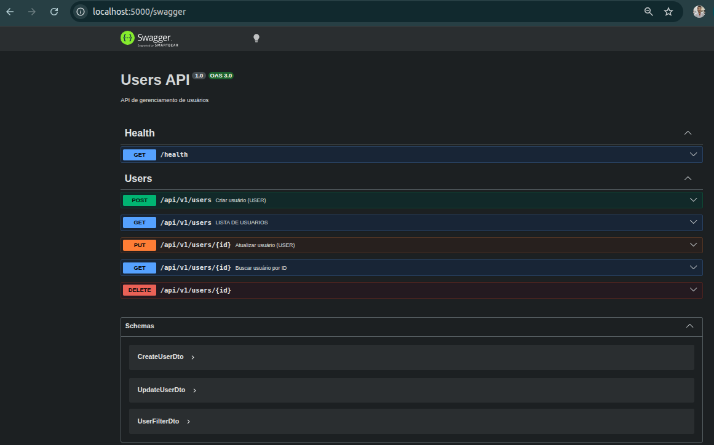
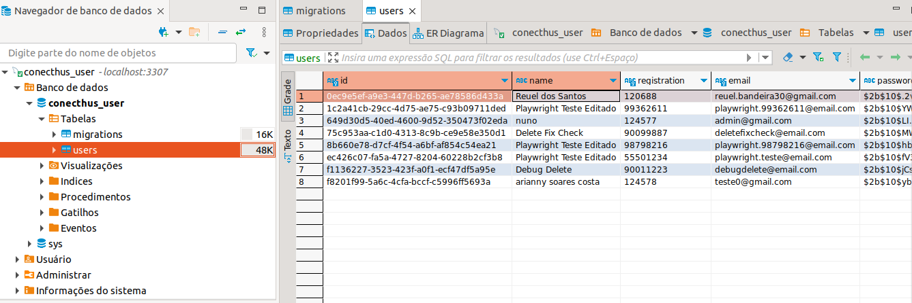

# WenLock — CRUD de Usuários

Desafio técnico full stack: API NestJS + TypeORM/MySQL (`backend`) e frontend React (`frontend`), baseado na spec e no design fornecidos.

- [`backend/README.md`](backend/README.md) — arquitetura, decisões, migrations, testes do backend.
- [`frontend/README.md`](frontend/README.md) — arquitetura, decisões de validação, testes do frontend.

## Em Funcionamento

**Documentação da API (Swagger)** — `http://localhost:5000/swagger`



**Banco de dados (MySQL)** — tabela `users`, com soft delete (a coluna `deletedAt` marca os registros removidos sem apagá-los)



## Rodando tudo de uma vez

```bash
cp backend/.env.example backend/.env
docker compose up -d --build
```

Sobe banco (MySQL), API (`http://localhost:5000/api/v1`, migrations automáticas, Swagger em `http://localhost:5000/swagger`) e frontend (`http://localhost:8080`).

Só o backend precisa de `.env` aqui — o frontend não. A URL da API (`VITE_API_BASE_URL`) já vem fixa no `args:` do serviço `web` deste `docker-compose.yml`, porque o Vite embute essa variável no bundle estático em tempo de build (não dá pra ler de `.env` em runtime como o backend faz). O `frontend/.env` só entra em cena no fluxo de desenvolvimento isolado (`npm run dev`) logo abaixo.

**Não rode isso ao mesmo tempo que o `docker compose up` de dentro de `backend/`** — os dois usam os mesmos nomes de container (`conecthus-user-api`, `conecthus-user-api-db`) e vão conflitar. São duas portas de entrada pro mesmo backend: use o compose da raiz para ver o sistema completo rodando, ou os compose/scripts de cada pasta para desenvolver em cada parte isoladamente (com hot-reload).

## Desenvolvendo cada parte isoladamente

```bash
# Backend (hot-reload)
cd backend
docker compose up -d --build

# Frontend (hot-reload, Vite dev server)
cd frontend
cp .env.example .env
npm install && npm run dev
```

## Testes

```bash
cd backend && npm run test    # 26 testes (domínio + use-cases)
cd frontend && npm run test    # 51 testes (schemas, componentes, páginas)
```
